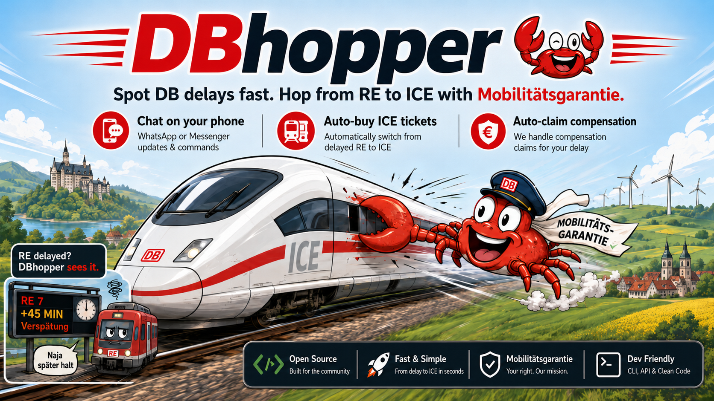

# DBhopper

OpenClaw tools for Deutsche Bahn delay retrieval, NRW Mobilitätsgarantie claims,
and replacement-ticket workflows.

DBhopper keeps private values in local files and returns deterministic tool
results. Agents should not clean raw DB or website payloads with the LLM.

## Local Setup

```bash
openclaw plugins install -l /home/iz/Dropbox/projects/openclaw/own-plugins/dbhopper
openclaw plugins enable dbhopper
```

Configure `plugins.entries.dbhopper.config.workspaceRoot` to this plugin
directory. DBhopper uses one local settings file:

```text
assets/private/settings.toml
```

This file is user-managed runtime state. It selects external private directories
with `path_usr`, `path_clm`, `path_buy`, `path_pym`, and `path_prc`. Those
directories must be outside the plugin workspace/package root. The plugin
process may read and write them, but coding agents and read/write workspace
tools should not be granted access to those external directories.

The repo ignores private runtime files under `assets/private/` through both
`.gitignore` and `.clawhubignore`, so local settings and purchase-review
screenshots stay out of git commits, pull requests, and Clawhub packages.

Safe boilerplate TOML files live under `docs/examples/`. Copy only the settings
example into `assets/private/`; copy real credential/profile templates into an
external private directory:

```bash
mkdir -p assets/private ../dbhopper-private/credentials \
  ../dbhopper-private/profiles ../dbhopper-private/purchases
cp docs/examples/settings.example.toml assets/private/settings.toml
cp docs/examples/private-profile.example.toml \
  ../dbhopper-private/profiles/private-profile-01.toml
cp docs/examples/buying-profile.example.toml \
  ../dbhopper-private/profiles/buying-profile-01.toml
cp docs/examples/credentials.example.toml \
  ../dbhopper-private/credentials/credentials-01.toml
cp docs/examples/payment-profile.example.toml \
  ../dbhopper-private/credentials/payment-profile-01.toml
```

TOML field names are case-sensitive; use the spelling shown in the examples.

## Configuration

`assets/private/settings.toml` controls workflow gates, selected private IDs,
profile scan directories, and delay-provider defaults:

```toml
use_delay_retrieval = true
use_claim_requests = false
use_ticket_purchase = false
test_run_claim_request = false
test_run_purchase = false

ID_USR = "01"
ID_CLM = "01"
ID_BUY = "01"
ID_PYM = "01"
claim_request_mode = "review"
purchase_mode = "review"
path_usr = "../dbhopper-private/credentials"
path_clm = "../dbhopper-private/profiles"
path_buy = "../dbhopper-private/profiles"
path_pym = "../dbhopper-private/credentials"
path_prc = "../dbhopper-private/purchases"
delay_provider = "bahn-web"
delay_fallback = "none"
```

The four `path_*` fields are directories to scan for TOML files with matching
IDs:

- `path_usr` is scanned for files containing `ID_USR`.
- `path_clm` is scanned for files containing `ID_CLM`.
- `path_buy` is scanned for files containing `ID_BUY`.
- `path_pym` is scanned for files containing `ID_PYM`.
- `path_prc` stores sensitive ticket checkout review screenshots.

The directories may be identical if you want all private TOML files in one
folder. They may also be split by type. In either case, DBhopper resolves the
selected file by scanning the configured directory for exactly the matching
`ID_*` value. DBhopper rejects any `path_*` directory inside the plugin
workspace, including `assets/private/`.

DBhopper still registers the full public tool contract. When a disabled workflow
tool is called, it returns a structured `feature_disabled` result instead of
running browser automation or writing files. You can edit `settings.toml`
manually, or ask the agent to use `dbhopper_private_settings_configure`.
Important runtime settings changes are previewed first and written only after
explicit confirmation with `confirm: true`.

### 1. Delay retrieval

`bahn-web` uses Deutsche Bahn passenger website JSON retrieval and works without
DB API Marketplace credentials. It is deterministic after retrieval, but the
website endpoint is unofficial and may change.

To change the default delay provider, edit `delay_provider` in
`assets/private/settings.toml` or use `dbhopper_private_settings_configure`.
Supported values are `"bahn-web"`, `"db-timetables"`, and `"auto"`. Keep
`delay_fallback = "none"` unless the agent should automatically retry with the
other provider after a provider failure.

For the official provider, create a DB API Marketplace application, subscribe it
to the Timetables product, and put the technical credentials in `[bahn_api]` of
the selected credential TOML file.

1. Register and log in at
   `https://developers.deutschebahn.com/db-api-marketplace/apis/`.
2. Open getting started, "Los gehts", step 02, then click "Neue Anwendung
   erstellen".
3. Fill the application form:
   - title: "DBhopper Timetables Delay Lookup"
   - "Zertifikat": leave empty
   - description: Local DBhopper tool for Deutsche Bahn Timetables API delay
     lookup. Uses station, plan, fchg, and rchg endpoints for deterministic
     train-delay queries. No OAuth redirect flow.
   - "OAuth-Umleitungs-URL(s)": leave empty
   - click "Speichern"
4. On "Neue Anwendungsberechtigungsnachweise", copy "Client ID" and "Client
   Secret (API KEY)" into the selected credentials file:

   ```toml
   [bahn_api]
   client_id = "..."
   api_key = "..."
   ```

5. Use "Produktsuche" or "Katalog auswählen", search for `Timetable`, choose the
   free subscription, link the application to that subscription, and subscribe
   to the usage plan.
6. Under "Anwendungen", open the new application and verify:
   - product: `Timetables` with its version number
   - plan: `Free`

The free Timetables subscription currently offers 60 calls per minute.

### 2. Autonomous claims

Autonomous claim tools are disabled by default. Enable them explicitly:

```toml
use_claim_requests = true
```

Claim-specific journey, ticket, and file data is stored in
`claims/<claim-id>/claim.toml`. Claimant and bank details stay in the selected
claim profile and are joined in memory for validation and browser filing. A
successful submit writes `claim_submitted_recipe.toml` next to the downloaded
confirmation PDF as the joined audit recipe.

Use `assets/private/settings.toml` to select the claim profile and credential
IDs used for claim filing. Claim filing uses `ID_CLM` from `path_clm`.

`claim_request_mode = "review"` is the default. Claim filing stops at the
Mobilitätsgarantie summary page, returns `summaryScreenshot`, and does not click
`Angaben absenden`. `claim_request_mode = "auto"` allows submit mode only when
the tool call also passes `mode: "submit"` and `confirmSubmit: true`.

### 3. Autonomous ticket buying

Autonomous ticket-buying tools are disabled by default. Enable them explicitly:

```toml
use_ticket_purchase = true
```

Ticket buying uses the selected private IDs from `assets/private/settings.toml`:

- `ID_USR`: Bahn account credentials and browser profile.
- `ID_BUY`: fare, class, and customer-data choices.
- `ID_PYM`: payment method and fillable payment fields.
- `claim_request_mode`: final Mobilitätsgarantie summary-page behavior.
- `purchase_mode`: final Check-page behavior.

`purchase_mode = "review"` is the default. Checkout may fill the configured
forms and reach DB's final Check page, then it saves a sensitive screenshot
artifact for user inspection and stops before any final order control.

`purchase_mode = "auto"` records that automatic buying was requested, but final
buying is not enabled yet. The tool returns `auto_unavailable` before any final
order button.

Change the mode with `dbhopper_private_settings_configure` by passing
`purchase_mode: "review"` or `purchase_mode: "auto"`. The tool previews the
meaning of the change and requires explicit confirmation before writing.

Buying profiles support `super_sparpreis`, `sparpreis`, `flexpreis`, and
`cheapest_available`. Payment-profile summaries expose only method and
field-presence metadata, never payment values. Logged-in DB account identity
fields are checked but not changed.

## Usage

### Delay retrieval

Ask the agent to query train delays and direct replacement options. The main
tool is `dbhopper_query_db_delay`; setup diagnostics include
`dbhopper_db_api_credential_probe` and `dbhopper_db_marketplace_access_check`.

Example parameters:

```json
{
  "provider": "auto",
  "departure_station": "Hamm(Westf)Hbf",
  "arrival_station": "Koeln Hbf",
  "service_date": "2026-05-25",
  "query_time": "19:00",
  "window_width_minutes": 45,
  "delay_threshold_minutes": 20,
  "force_query_departure_time": true,
  "long_distance_replacement_types": ["ICE", "IC", "EC"]
}
```

`dbhopper_query_db_delay` uses inclusive bounds around the explicit query time:
`[query_time - window_width_minutes, query_time + window_width_minutes]`. It
checks regional candidates by delay at the boarding station and checks direct
ICE/IC/EC replacement candidates for reachability.

The query response is already normalized for downstream use. `table_rows`
contains display-ready route candidates, while `cleaned_summary` contains
candidate counts and reachability booleans. Timetables and `bahn-web` preserve
both the public line, such as `RE6`, and the technical identity, such as
`NX 89718`.

Time fields ending in `_time` are canonical UTC ISO timestamps. User-facing
answers should use `normalized_input.query_time_local`, the `window.*_local`
fields, row-level `_time_local` fields, and `local_time_zone`. Do not present
the UTC `Z` fields as local clock times. Rows use
`role = "delayed_regional"` for delayed regional services and
`role = "reachable_replacement"` for direct ICE/IC/EC replacement candidates.
`cleaned_summary.replacements_without_delayed_regional` is true when replacement
trains were found but no delayed regional candidate matched the query.

### Autonomous claims

With `use_claim_requests: true`, the agent can prepare, validate, and file NRW
Mobilitätsgarantie claims:

- `dbhopper_prepare_claim` creates or replaces a local claim folder.
- `dbhopper_validate_claim` checks deterministic eligibility facts.
- `dbhopper_run_claim` drives the browser filing flow for a prepared claim.

`dbhopper_run_claim` defaults to dry-run behavior and submits only after the
explicit confirmation fields are set. OpenClaw approval hooks can require
approval for all claim tools or only mutating claim tools, depending on
`approvalMode`.

### Autonomous ticket buying

With `use_ticket_purchase = true`, the agent can use ticket-buying workflows for
a replacement train after delay retrieval identifies a reachable option.

The main ticket tools are:

- `dbhopper_db_standard_login_check` verifies the selected Bahn account and
  browser profile.
- `dbhopper_ticket_buying_research` returns the deterministic purchase-path
  assumptions.
- `dbhopper_ticket_buying_dry_run` searches for replacement-ticket options.
- `dbhopper_ticket_checkout_dry_run` explores checkout with hard safety gates.

Use these tools after the delay result identifies the target route, service
date, train label, and departure time. Ticket workflows use deterministic
browser automation. In review mode, the checkout tool stores the user-facing
`reviewScreenshot` under configured `path_prc` and returns that path for the
agent to show to the user. Per-stage page text and screenshot trails are
test-run artifacts only; set `test_run_purchase = true` in `settings.toml` when
explicitly asked to create that numbered comparison trail under external
`path_prc/test-runs`.
In auto mode, final buying still stops with `auto_unavailable`; there is no
final purchase click yet. The agent should not infer or invent checkout state
from screenshots or raw page text.

## Security Architecture

DBhopper is designed so the OpenClaw agent can request DB delay, claim, and
ticket purchasing workflows without receiving the private/sensitive data of the
user. The agent and Gateway see tool schemas, approval prompts, selected IDs,
file/path metadata, boolean presence flags, normalized results, and local
artifact paths: data that is necessary to orchestrate/drive the workflow via the
plugin code. They do not receive DB account passwords, DB API keys, payment
values, claimant profile values, bank data, cookies, or raw private profile TOML
content through normal tool results. Thus, the openclaw-agent only acts as an
orchestrator driving the local machine via CLI/tool commands, and manages user
interaction through exposed channels, usually something like WhatsApp, Signal,
Telegram, or some web interface.

The local DBhopper plugin process is the actual engine/coding layer. It reads
`assets/private/settings.toml`, resolves `ID_USR`, `ID_CLM`, `ID_BUY`, and
`ID_PYM` against the external `path_usr`, `path_clm`, `path_buy`, and `path_pym`
directories, stores claim review screenshots under the selected claim folder,
stores purchase review screenshots under `path_prc`, and loads information from
the selected TOML files locally. DBhopper **strictly rejects**
those `path_*` directories when they resolve inside the plugin workspace which
is often exposed to the agent: so the normal setup keeps real credentials,
profiles, and purchase artifacts outside the workspace that coding agents can
inspect. Through the configuration, the user is strongly advised to set paths
outside of the read/write file system access of the agent.

Sensitive values are used inside the plugin process. DB account credentials and
payment fields are passed to Playwright form controls through DBhopper's
sensitive input helper, which sets the browser DOM value in the page context: to
keep the agent informed, it returns only generic success/failure state to it.

DB API Marketplace credentials are attached as request headers inside the
delay-provider code. Claimant and bank profile values are merged in memory for
validation and browser filing. This is nothing different than filing a web
browser form manually. The user is strongly advised to keep banking and user
credentials in storage places that are secure:

1. not exposed to the agent **and**
2. not exposed to the internet

Local artifacts are intentionally local and should be treated as sensitive.
Claim browser runs save only the final summary screenshot under the external
claim folder by default. Ticket checkout review mode writes the final
user-review screenshot under configured `path_prc`. Page-by-page text and
screenshot trails are created only when `test_run_claim_request = true` or
`test_run_purchase = true` is set in `settings.toml`. These artifact paths may
be returned to the agent, but the files themselves remain on the local machine
unless the user chooses to inspect or share them.

```text
+------------------------------+                +------------------------------+
| I. Local machine             |                | II. OpenClaw agent + Gateway |
+------------------------------+                +------------------------------+
| storage of sensitive data    |                | sees workflow status info:   |
|                              |                |  -> to drive local machine   |
| 1. profiles in .TOML files   |                | does NOT see sensitive data: |
|   - DB logins and API keys   |                |  -> no TOML settings /secrets|
|   - claim requests data      |                |  -> no profile/payment data  |
| 2. private data in TOML files|                |  -> no browser/session data  |
| - ticket and banking data    |                +----+-----+-------------------+
| - browser profile / cookies  |                     |     ^ redacted, i.e.,
| - claims, evidence, artifacts|          tool calls |     | processed info
+-----+------------------------+                     v     |
      ^                                 +------------+-----+-------------------+
      |                                 | III. DBhopper plugin process         |
      |                                 +--------------------------------------+
      |  reads settings file locally    | validates settings/TOML files, then: |
      |  reads private .toml locally    |   1. delay retrieval from DB         |
      +---------------------------------|   2. claim filing/mobilitätsgarantie |
                                        |   3. ticket search/purchase          |
                                        +--------------------+-----------------+
                                                             |
                                                             |
                         fills browser controls locally:     |
                         -> sends forms/requests to websites |
                                                             v
                                     +-----------------------+----------------+
                                     | IV. DB, bahn.de, DB API, NRW form      |
                                     +----------------------------------------+
                                     | DB Timetables and bahn-web delay       |
                                     | Mobilitaetsgarantie claim form         |
                                     | DB account login and ticket purchasing |
                                     +----------------------------------------+
```

## Troubleshooting

If an OpenClaw-routed agent can describe the skill but cannot call `dbhopper_*`,
check the sandbox tool policy. The local config needs DBhopper in both
`tools.alsoAllow` and `tools.sandbox.tools.alsoAllow`.

If a workflow tool returns `feature_disabled`, check
`assets/private/settings.toml` or ask the agent to use
`dbhopper_private_settings_configure` for the suggested `use_*` change. The
configure tool previews the change and writes only after explicit confirmation.

## Development

```bash
npm run build
npm run plugin:build
npm run plugin:validate
npm test
npm run package:check
```
